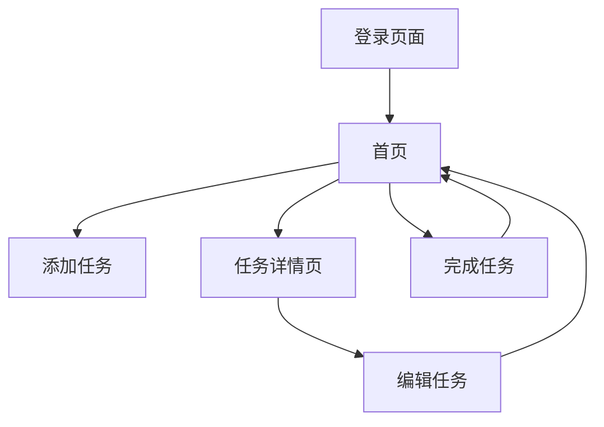

## 1. Product Overview
任务管理应用是一个帮助用户组织和跟踪日常任务的工具，提高工作效率和时间管理能力。
- 主要解决用户任务管理混乱、遗忘重要任务的问题，目标用户为需要管理个人或团队任务的个人。
- 产品价值在于帮助用户更有效地规划时间，提高工作效率，减少任务遗漏。

## 2. Core Features

### 2.1 User Roles
| Role | Registration Method | Core Permissions |
|------|---------------------|------------------|
| Normal User | Email registration | Create, edit, delete tasks; mark tasks as complete |
| Admin User | Invitation only | All user permissions + user management |

### 2.2 Feature Module
1. **登录页面**: 用户登录和注册功能
2. **首页**: 任务列表、任务分类、快速添加任务
3. **任务详情页**: 任务详细信息、编辑任务、任务历史

### 2.3 Page Details
| Page Name | Module Name | Feature description |
|-----------|-------------|---------------------|
| 登录页面 | 登录模块 | 用户输入邮箱和密码登录，支持忘记密码功能 |
| 登录页面 | 注册模块 | 新用户注册，邮箱验证 |
| 首页 | 任务列表 | 显示所有任务，支持按状态、优先级、截止日期排序 |
| 首页 | 任务分类 | 按分类查看任务，如工作、个人、紧急等 |
| 首页 | 快速添加 | 快速添加新任务，设置标题、优先级、截止日期 |
| 任务详情页 | 任务信息 | 显示任务详细信息，包括标题、描述、优先级、截止日期、状态 |
| 任务详情页 | 编辑功能 | 编辑任务信息，更新状态 |
| 任务详情页 | 任务历史 | 显示任务的修改历史 |

## 3. Core Process
用户流程：用户登录 → 进入首页查看任务 → 添加新任务 → 查看任务详情 → 编辑任务状态 → 完成任务

## 4. User Interface Design
### 4.1 Design Style
- 主色调：#3B82F6（蓝色）、#10B981（绿色）
- 次要色调：#6B7280（灰色）、#EF4444（红色）
- 按钮样式：圆角按钮，有轻微的阴影效果
- 字体：Inter 字体，标题 18-24px，正文 14-16px
- 布局风格：卡片式布局，顶部导航栏
- 图标风格：线性图标，简洁现代

### 4.2 Page Design Overview
| Page Name | Module Name | UI Elements |
|-----------|-------------|-------------|
| 登录页面 | 登录模块 | 居中卡片式表单，包含邮箱、密码输入框，登录按钮，忘记密码链接 |
| 登录页面 | 注册模块 | 与登录模块类似，包含邮箱、密码、确认密码输入框，注册按钮 |
| 首页 | 任务列表 | 卡片式任务项，包含任务标题、优先级标签、截止日期、状态指示器 |
| 首页 | 任务分类 | 侧边栏分类导航，点击切换分类 |
| 首页 | 快速添加 | 页面底部固定的添加按钮，点击弹出添加任务表单 |
| 任务详情页 | 任务信息 | 顶部任务标题，下方详细信息，包括描述、优先级、截止日期、状态 |
| 任务详情页 | 编辑功能 | 编辑按钮，点击进入编辑模式，保存按钮 |
| 任务详情页 | 任务历史 | 时间线式历史记录，显示每次修改的内容和时间 |

### 4.3 Responsiveness
- 桌面优先设计，适配移动端
- 移动端采用单列布局，导航栏转为底部导航
- 支持触摸操作，按钮和可点击元素尺寸适合触摸

### 4.4 3D Scene Guidance
- 无3D场景需求