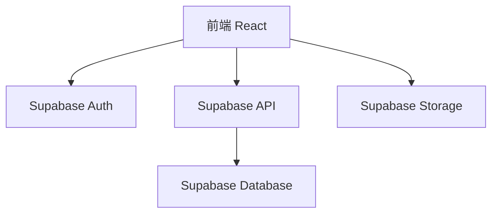
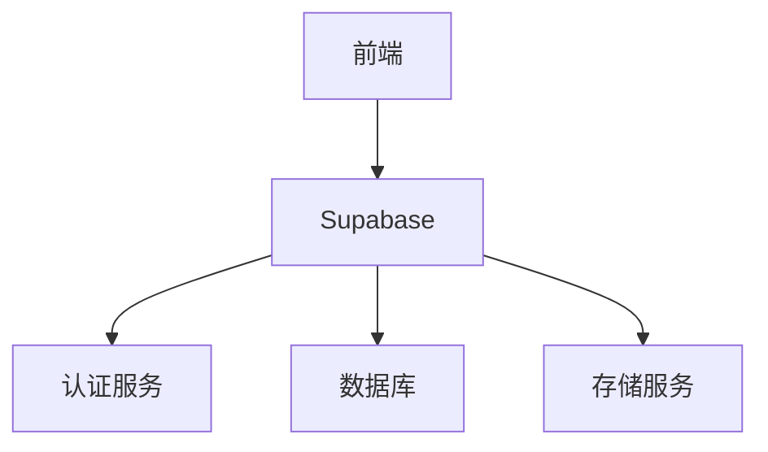
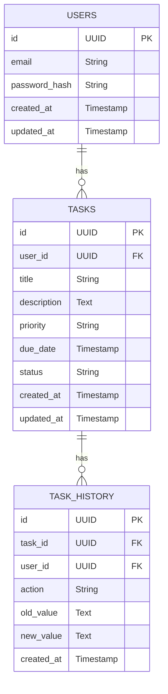

## 1. Architecture Design


## 2. Technology Description
- Frontend: React@18 + tailwindcss@3 + vite
- Initialization Tool: vite-init
- Backend: Supabase
- Database: Supabase (PostgreSQL)

## 3. Route Definitions
| Route | Purpose |
|-------|---------|
| /login | 登录页面 |
| /register | 注册页面 |
| / | 首页，显示任务列表 |
| /task/:id | 任务详情页 |
| /task/new | 创建新任务 |
| /task/:id/edit | 编辑任务 |

## 4. API Definitions
### 4.1 Authentication API
- 登录: `supabase.auth.signInWithPassword({ email, password })`
- 注册: `supabase.auth.signUp({ email, password })`
- 登出: `supabase.auth.signOut()`
- 获取当前用户: `supabase.auth.getUser()`

### 4.2 Task API
- 获取任务列表: `supabase.from('tasks').select('*').eq('user_id', user.id)`
- 获取任务详情: `supabase.from('tasks').select('*').eq('id', taskId).single()`
- 创建任务: `supabase.from('tasks').insert({ title, description, priority, due_date, status, user_id: user.id })`
- 更新任务: `supabase.from('tasks').update({ title, description, priority, due_date, status }).eq('id', taskId)`
- 删除任务: `supabase.from('tasks').delete().eq('id', taskId)`

## 5. Server Architecture Diagram


## 6. Data Model
### 6.1 Data Model Definition


### 6.2 Data Definition Language
```sql
-- 创建tasks表
CREATE TABLE IF NOT EXISTS tasks (
    id UUID PRIMARY KEY DEFAULT gen_random_uuid(),
    user_id UUID NOT NULL,
    title VARCHAR(255) NOT NULL,
    description TEXT,
    priority VARCHAR(50) DEFAULT 'medium',
    due_date TIMESTAMP,
    status VARCHAR(50) DEFAULT 'pending',
    created_at TIMESTAMP DEFAULT NOW(),
    updated_at TIMESTAMP DEFAULT NOW()
);

-- 创建task_history表
CREATE TABLE IF NOT EXISTS task_history (
    id UUID PRIMARY KEY DEFAULT gen_random_uuid(),
    task_id UUID NOT NULL,
    user_id UUID NOT NULL,
    action VARCHAR(50) NOT NULL,
    old_value TEXT,
    new_value TEXT,
    created_at TIMESTAMP DEFAULT NOW()
);

-- 创建索引
CREATE INDEX IF NOT EXISTS idx_tasks_user_id ON tasks(user_id);
CREATE INDEX IF NOT EXISTS idx_tasks_status ON tasks(status);
CREATE INDEX IF NOT EXISTS idx_tasks_priority ON tasks(priority);
CREATE INDEX IF NOT EXISTS idx_tasks_due_date ON tasks(due_date);
CREATE INDEX IF NOT EXISTS idx_task_history_task_id ON task_history(task_id);

-- 授予权限
GRANT SELECT ON tasks TO anon;
GRANT ALL PRIVILEGES ON tasks TO authenticated;
GRANT SELECT ON task_history TO anon;
GRANT ALL PRIVILEGES ON task_history TO authenticated;

-- 创建Row Level Security策略
ALTER TABLE tasks ENABLE ROW LEVEL SECURITY;
CREATE POLICY "Users can view their own tasks" ON tasks FOR SELECT USING (user_id = auth.uid());
CREATE POLICY "Users can insert their own tasks" ON tasks FOR INSERT WITH CHECK (user_id = auth.uid());
CREATE POLICY "Users can update their own tasks" ON tasks FOR UPDATE USING (user_id = auth.uid());
CREATE POLICY "Users can delete their own tasks" ON tasks FOR DELETE USING (user_id = auth.uid());

ALTER TABLE task_history ENABLE ROW LEVEL SECURITY;
CREATE POLICY "Users can view task history for their own tasks" ON task_history FOR SELECT USING (user_id = auth.uid());
CREATE POLICY "Users can insert task history for their own tasks" ON task_history FOR INSERT WITH CHECK (user_id = auth.uid());
```